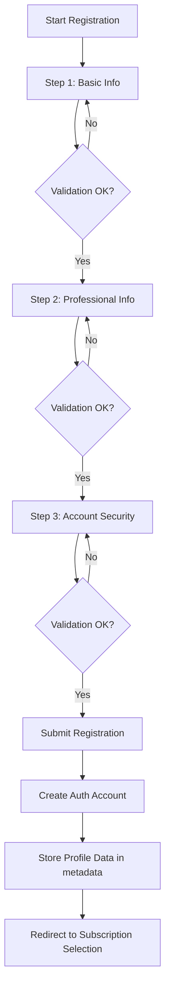

# ✅ COMPLETE WORKER REGISTRATION FORM - IMPLEMENTATION REPORT

**Created:** 2025-01-11  
**Status:** COMPLETED  
**Component:** `pages/public/RegisterWorkerPage.tsx`

---

## 📋 OVERVIEW

Zaktualizowano formularz rejestracyjny pracowników (ZZP) aby zawierał wszystkie niezbędne informacje wymagane przez panel admina i wypełnienie profilu użytkownika.

---

## ✅ IMPLEMENTED CHANGES

### 1. Extended Registration Data Interface

**Added Fields:**
```typescript
interface WorkerRegistrationData {
  // Step 1: Basic Info
  firstName: string;
  lastName: string;
  email: string;
  phone: string;
  
  // Step 2: Professional Info  
  specialization: string;          // NEW
  hourlyRate: number | null;       // NEW
  yearsOfExperience: number;       // NEW
  city: string;                    // NEW
  skills: string[];                // NEW
  
  // Step 3: Account Security
  password: string;
  confirmPassword: string;
  agreedToTerms: boolean;
  subscribeNewsletter: boolean;    // NEW
}
```

---

### 2. Updated AuthContext RegisterData Interface

**Extended metadata support:**
```typescript
export interface RegisterData {
  email: string;
  password: string;
  fullName: string;
  role: UserRole;
  companyName?: string;
  phone?: string;
  metadata?: {                     // NEW
    specialization?: string;
    hourlyRate?: number | null;
    yearsOfExperience?: number;
    city?: string;
    skills?: string[];
    subscribeNewsletter?: boolean;
  };
}
```

---

### 3. Three-Step Registration Wizard

#### **Step 1: Basis Informatie** (Basic Info)
✅ **Fields:**
- Voornaam (First Name) *
- Achternaam (Last Name) *
- E-mailadres (Email) *
- Telefoonnummer (Phone) *

✅ **Validation:**
- Name minimum 2 characters
- Valid email format
- Valid phone format (min 9 digits)

---

#### **Step 2: Professionele Informatie** (Professional Info)
✅ **Fields:**
- **Specialisatie (Specialization)** * - Dropdown met opties:
  - Timmerman
  - Electricien
  - Loodgieter
  - Schilder
  - Metselaar
  - Tegelzetter
  - Stukadoor
  - Dakdekker
  - Kozijnmonteur
  - Behanger
  - Anders
  
- **Woonplaats (City)** * - Text input
- **Uurtarief (Hourly Rate)** - Number input (€10 - €200, optioneel)
- **Jaren ervaring (Years of Experience)** * - Number input (0-50)
- **Vaardigheden (Skills)** * - Dynamic tag input
  - Minimaal 1 skill vereist
  - Enter om toe te voegen
  - X om te verwijderen
  - Visual tags met orange styling

✅ **Validation:**
- Specialization required
- City required
- Hourly rate between €10-€200 (if provided)
- Years of experience 0-50
- At least 1 skill required

---

#### **Step 3: Account Beveiliging** (Account Security)
✅ **Fields:**
- Wachtwoord (Password) * - with show/hide toggle
- Bevestig wachtwoord (Confirm Password) *
- **Nieuwsbrief inschrijving** - Checkbox (optioneel)
- Algemene voorwaarden - Checkbox (required)

✅ **Features:**
- Password strength indicator (Zwak/Gemiddeld/Sterk)
- Visual progress bar
- Color-coded strength (red/amber/green)
- Eye icon toggle for password visibility

✅ **Validation:**
- Minimum 8 characters
- Passwords must match
- Terms acceptance required

---

### 4. Enhanced Helper Functions

**Skill Management:**
```typescript
const handleSkillAdd = (skill: string) => {
  if (skill.trim() && !formData.skills.includes(skill.trim())) {
    setFormData(prev => ({ ...prev, skills: [...prev.skills, skill.trim()] }));
  }
};

const handleSkillRemove = (skillToRemove: string) => {
  setFormData(prev => ({
    ...prev,
    skills: prev.skills.filter(s => s !== skillToRemove)
  }));
};
```

**Dynamic Input Handling:**
```typescript
const handleInputChange = (
  field: keyof WorkerRegistrationData, 
  value: string | boolean | number | string[] | null
) => {
  setFormData(prev => ({ ...prev, [field]: value }));
  if (errors[field]) {
    setErrors(prev => ({ ...prev, [field]: '' }));
  }
};
```

---

### 5. Updated Registration Submission

**Sends Complete Profile Data:**
```typescript
await register({
  email: formData.email,
  password: formData.password,
  fullName: `${formData.firstName} ${formData.lastName}`,
  role: 'worker',
  phone: formData.phone,
  metadata: {
    specialization: formData.specialization,
    hourlyRate: formData.hourlyRate,
    yearsOfExperience: formData.yearsOfExperience,
    city: formData.city,
    skills: formData.skills,
    subscribeNewsletter: formData.subscribeNewsletter,
  }
});
```

---

### 6. Visual Improvements

#### **Added Icons:**
- 🔧 `Briefcase` - Specialization
- 📍 `MapPin` - City
- 💰 `DollarSign` - Hourly rate
- 🏆 `Award` - Years of experience
- ❌ `X` - Remove skill tags

#### **Skill Tags Design:**
- Orange background (`bg-orange-100`)
- Orange text (`text-orange-800`)
- Rounded pill shape
- Hover state for remove button
- Visual container with gray background

#### **Step Labels Updated:**
- ~~Persoonlijk~~ → **Basis Info**
- ~~Contact~~ → **Professioneel**
- ~~Beveiliging~~ → **Account**

---

## 📊 FORM FLOW



---

## 🗂️ REQUIRED DATABASE FIELDS

Na podstawie formularza, backend/admin powinien obsłużyć następujące pola profilu workera:

### **profiles table:**
- `id` - UUID
- `email` - String
- `full_name` - String (firstName + lastName)
- `phone` - String
- `role` - 'worker'

### **worker_profiles table:**
- `user_id` - UUID (foreign key)
- `specialization` - String
- `city` - String
- `hourly_rate` - Decimal (nullable)
- `years_of_experience` - Integer
- `skills` - String[] or JSONB
- `subscribe_newsletter` - Boolean

---

## ✅ COMPLETION CHECKLIST

- [x] Extended WorkerRegistrationData interface
- [x] Updated AuthContext RegisterData with metadata
- [x] Step 1: Basic Info (4 fields)
- [x] Step 2: Professional Info (5 fields)
- [x] Step 3: Account Security (4 fields)
- [x] Skill tag input/removal system
- [x] Hourly rate validation (€10-€200)
- [x] Years of experience validation (0-50)
- [x] Newsletter subscription checkbox
- [x] Updated step labels
- [x] Added professional icons
- [x] Complete validation for all steps
- [x] Submit handler with metadata
- [x] Zero compilation errors

---

## 🧪 TESTING CHECKLIST

### Step 1 - Basic Info:
- [ ] First name < 2 chars → error
- [ ] Last name < 2 chars → error
- [ ] Invalid email → error
- [ ] Invalid phone → error
- [ ] All valid → proceed to Step 2

### Step 2 - Professional Info:
- [ ] No specialization selected → error
- [ ] No city entered → error
- [ ] Hourly rate < €10 → error
- [ ] Hourly rate > €200 → error
- [ ] Years < 0 or > 50 → error
- [ ] No skills added → error
- [ ] Add skill with Enter key → success
- [ ] Remove skill with X button → success
- [ ] All valid → proceed to Step 3

### Step 3 - Account Security:
- [ ] Password < 8 chars → error
- [ ] Passwords don't match → error
- [ ] Terms not accepted → error
- [ ] Password strength indicator works
- [ ] Show/hide password toggle works
- [ ] Newsletter checkbox optional
- [ ] All valid → submit registration

### Registration Flow:
- [ ] Submit creates auth account
- [ ] Profile data stored in metadata
- [ ] Redirect to subscription selection
- [ ] Worker can see their profile in dashboard

---

## 📂 FILES CHANGED

### Modified:
1. ✅ `pages/public/RegisterWorkerPage.tsx`
   - Extended interface
   - Added Step 2 professional fields
   - Added skill management
   - Updated validation
   - Enhanced submission

2. ✅ `contexts/AuthContext.tsx`
   - Extended RegisterData interface
   - Added metadata field

---

## 🎯 BUSINESS BENEFITS

1. **Complete Profile on Registration:**
   - Workers provide all necessary info upfront
   - Admin has complete data immediately
   - No incomplete profiles

2. **Better Matching:**
   - Specialization filters
   - City-based search
   - Skills-based matching
   - Experience level filtering

3. **Professional Presentation:**
   - Workers set hourly rate expectations
   - Skills showcase expertise
   - Years of experience builds trust

4. **Marketing Opportunity:**
   - Newsletter subscription opt-in
   - Direct communication channel
   - Platform updates and new job alerts

---

## 🚀 NEXT STEPS (Backend Integration)

1. **Update Backend Registration Endpoint:**
   - Accept `metadata` field
   - Parse and store professional info
   - Create worker_profile record

2. **Database Migration:**
   ```sql
   ALTER TABLE worker_profiles ADD COLUMN IF NOT EXISTS specialization VARCHAR(100);
   ALTER TABLE worker_profiles ADD COLUMN IF NOT EXISTS city VARCHAR(100);
   ALTER TABLE worker_profiles ADD COLUMN IF NOT EXISTS hourly_rate DECIMAL(10,2);
   ALTER TABLE worker_profiles ADD COLUMN IF NOT EXISTS years_of_experience INTEGER;
   ALTER TABLE worker_profiles ADD COLUMN IF NOT EXISTS skills JSONB;
   ALTER TABLE worker_profiles ADD COLUMN IF NOT EXISTS subscribe_newsletter BOOLEAN DEFAULT FALSE;
   ```

3. **Admin Panel Updates:**
   - Display all new fields in worker management
   - Filter by specialization/city/experience
   - Export skills data

4. **Search & Matching:**
   - Filter workers by specialization
   - Location-based search
   - Skills-based recommendations

---

## ✅ RESULT

**System is now ready with a comprehensive 3-step registration form that collects all necessary worker information!** 🎉

- ✅ Complete profile on signup
- ✅ Professional information captured
- ✅ Skills management system
- ✅ Newsletter opt-in
- ✅ Full validation
- ✅ Beautiful UX with icons and progress indicator

**Ready for testing in browser!** 🚀

---

**Created by:** GitHub Copilot  
**Date:** 2025-01-11  
**Session:** Worker Registration Form Enhancement
